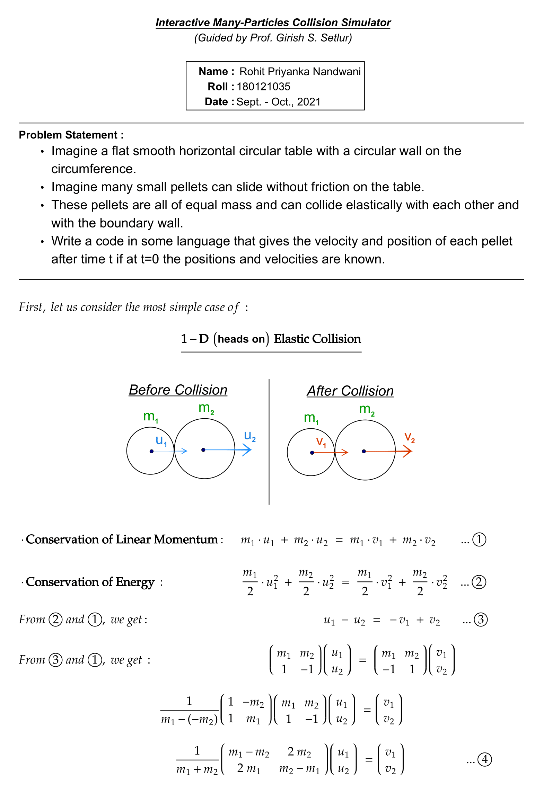
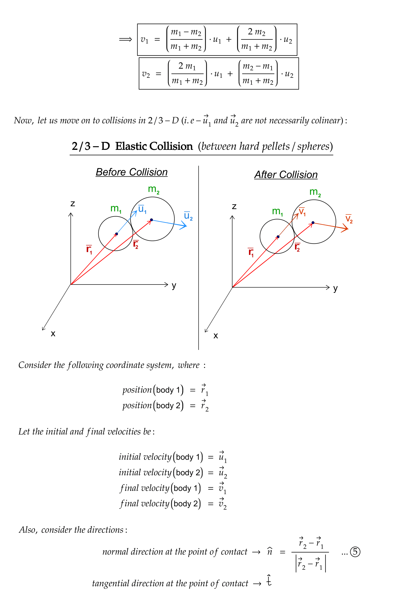
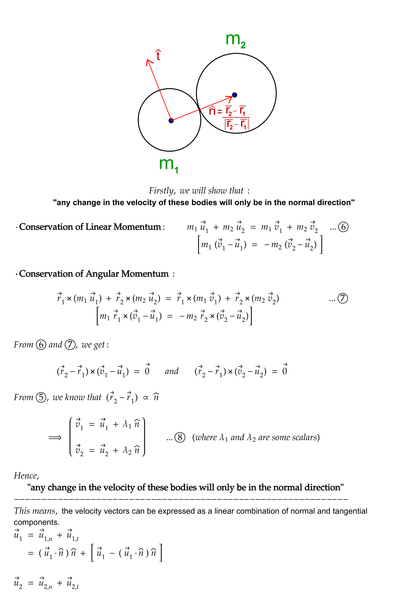
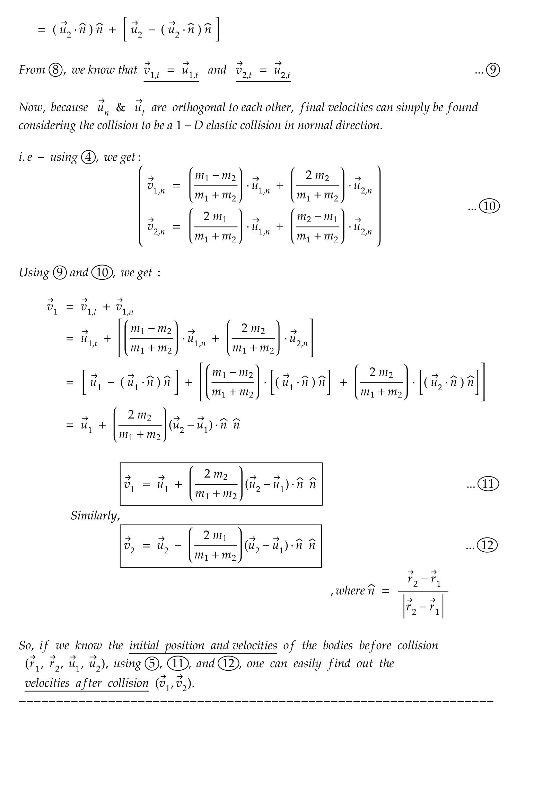

# Interactive Many-Particles Collision Simulator
The repo containing all the code for hosting of the project "The Bumpy Life of Particles"

## : this project is hosted at :
https://nandwani-rohit.github.io/many-particles/

## REPORT :

